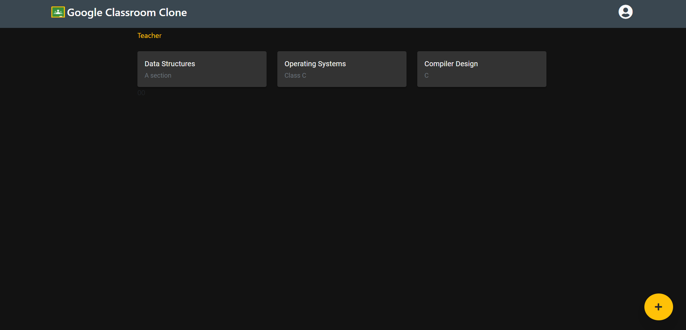
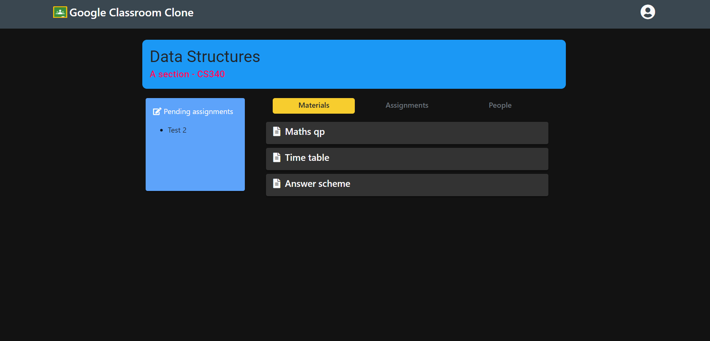
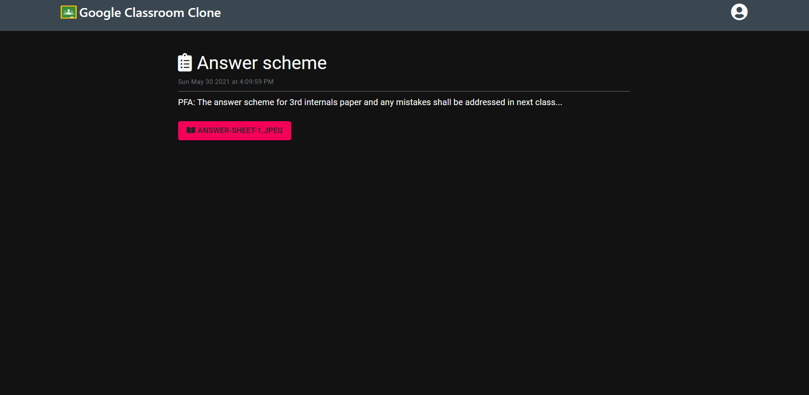
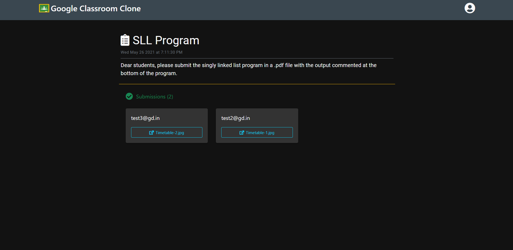
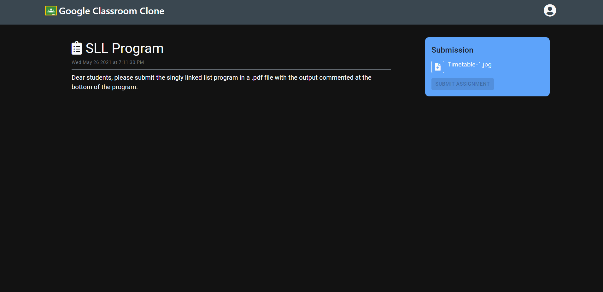

# Google Classroom Clone

##### Technologies

`React` `Firebase`

<h6>
#1 Home | #2 Subject Classroom | #3 Class Material | #4 Class Assignment Submission Views(Teacher) | #5 Class Assignment Submission (Student)
</h6>

[Similar Mobile App](https://github.com/A7abhilash/google-classroom-clone-app)
